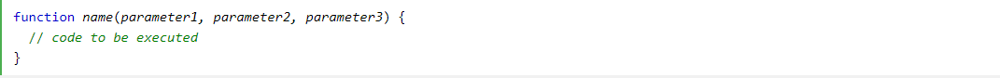

# Chapter 4 -HTML-
## HTML Links

Links are found in nearly all web pages. Links allow users to click their way from page to page.

I will explain what is Hyperlinks.
- HTML links are hyperlinks.
- You can click on a link and jump to another document.
- When you move the mouse over a link, the mouse arrow will turn into a little hand.
> Note: A link does not have to be text. A link can be an image or any other HTML element!

## HTML Links - Syntax

The HTML "a" tag defines a hyperlink. It has the following syntax:

<"a" href="url" link text"/a">

The most important attribute of the "a" element is the href attribute, which indicates the link's destination.

The link text is the part that will be visible to the reader.

Clicking on the link text, will send the reader to the specified URL address.

# Chapter 15 -CSS Layout-

## Website Layout
A website is often divided into headers, menus, content and a footer:

There are tons of different layout designs to choose from. However, the structure above, is one of the most common.

# Chapter 3 -JS-
## Functions, Methods, and Objects

*A JavaScript function is a block of code designed to perform a particular task.*

*A JavaScript function is executed when "something"  it (calls it).*

## JavaScript Function Syntax
- A JavaScript function is defined with the function keyword, followed by a name, followed by parentheses ().

- Function names can contain letters, digits, underscores, and dollar signs (same rules as variables).

- The parentheses may include parameter names separated by commas:
(parameter1, parameter2, ...)

- The code to be executed, by the function, is placed inside curly brackets: {}

- Function parameters are listed inside the parentheses () in the function definition.

- Function arguments are the values received by the function when it is invoked.

- Inside the function, the arguments (the parameters) behave as local variables.