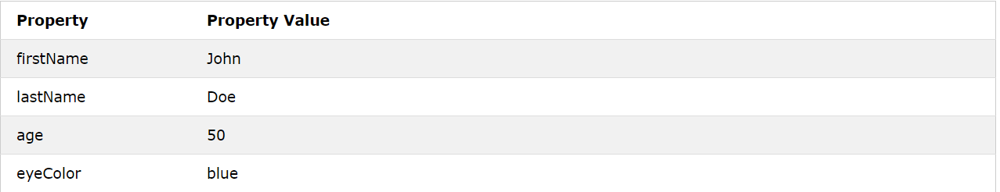
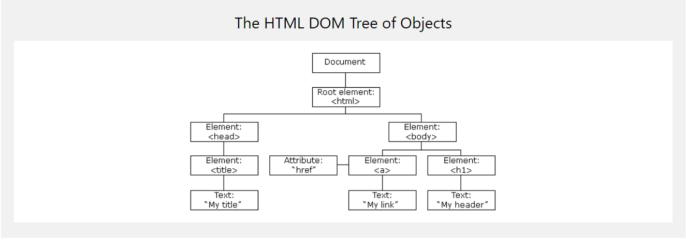

# Chapter 3 -JS-
## Object Literals

A JavaScript object literal is a comma-separated list of name-value pairs wrapped in curly braces. Object literals encapsulate data, enclosing it in a tidy package. This minimizes the use of global variables which can cause problems when combining code.

### Real Life Objects, Properties, and Methods

- In real life, a car is an object.
- A car has properties like weight and color, and methods like start and stop.
- All cars have the same properties, but the property values differ from car to car.
- All cars have the same methods, but the methods are performed at different times.

### JavaScript Objects
JavaScript variables are containers for data values.

This code assigns a simple value (Fiat) to a variable named car:

> var car = "Fiat";

Objects are variables too. But objects can contain many values.

This code assigns many values (Fiat, 500, white) to a variable named car:

> var car = {type:"Fiat", model:"500", color:"white"};

*The values are written as name:value pairs (name and value separated by a colon).*

*JavaScript objects are containers for named values called properties or methods.*

### Object Definition

You define (and create) a JavaScript object with an object literal:
>var person = {firstName:"John", lastName:"Doe", age:50, eyeColor:"blue"};

Spaces and line breaks are not important. An object definition can span multiple lines:

> var person = {
  firstName: "John",
  lastName: "Doe",
  age: 50,
  eyeColor: "blue"
};

### Object Properties

The name:values pairs in JavaScript objects are called properties:

# Chapter 5 -JS-
## Document Object Model

**The Document Object Model (DOM) is a cross-platform and language-independent interface that treats an XML or HTML document as a tree structure wherein each node is an object representing a part of the document. The DOM represents a document with a logical tree.**

When a web page is loaded, the browser creates a **D**ocument **O**bject **M**odel of the page.

The **HTML DOM** model is constructed as a tree of Objects:

### With the object model, JavaScript gets all the power it needs to create dynamic HTML:

- JavaScript can change all the HTML elements in the page.
- JavaScript can change all the HTML attributes in the page.
- JavaScript can change all the CSS styles in the page.
- JavaScript can remove existing HTML elements and attributes.
- JavaScript can add new HTML elements and attributes.
- JavaScript can react to all existing HTML events in the page.
- JavaScript can create new HTML events in the page.

### What is the DOM?

The DOM is a W3C (World Wide Web Consortium) standard.

The DOM defines a standard for accessing documents:

"The W3C Document Object Model (DOM) is a platform and language-neutral interface that allows programs and scripts to dynamically access and update the content, structure, and style of a document."

The W3C DOM standard is separated into 3 different parts:

- Core DOM - standard model for all document types.
- XML DOM - standard model for XML documents.
- HTML DOM - standard model for HTML documents.

### What is the HTML DOM?

The HTML DOM is a standard object model and programming interface for HTML. It defines:

- The HTML elements as objects.
- The properties of all HTML elements.
- The methods to access all HTML elements.
- The events for all HTML elements.
> In other words: The HTML DOM is a standard for how to get, change, add, or delete HTML elements.