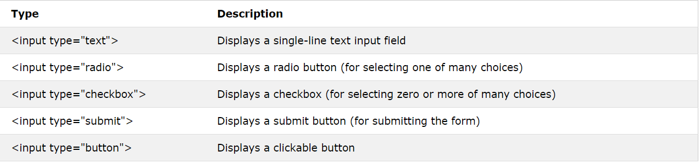

# Chapter 7 -HTML-

An HTML form is used to collect user input. The user input is most often sent to a server for processing.

## The "form" Element
The HTML "form" element is used to create an HTML form for user input.

The "form" element is a container for different types of input elements, such as: text fields, checkboxes, radio buttons, submit buttons, etc.

- The "input" Element
1. The HTML "input" element is the most used form element.

2. An "input" element can be displayed in many ways, depending on the type attribute.

# Chapter 6 -JS-
## Events

HTML events are "things" that happen to HTML elements.

When JavaScript is used in HTML pages, JavaScript can "react" on these events.

An HTML event can be something the browser does, or something a user does.

Here are some examples of HTML events:

- An HTML web page has finished loading
- An HTML input field was changed
- An HTML button was clicked

Often, when events happen, you may want to do something.

JavaScript lets you execute code when events are detected.

HTML allows event handler attributes, with JavaScript code, to be added to HTML elements.

> JavaScript code is often several lines long. It is more common to see event attributes calling functions.